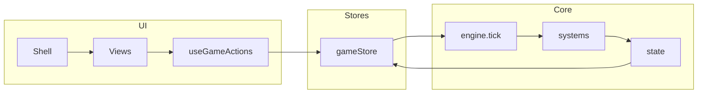

# Architektur

Kurzüberblick über State-Management, Datenfluss und Backend-API.

---

## Frontend: State und Spiel-Logik

### Zustand-Stores

- **gameStore** (`frontend/src/store/gameStore.ts`):  
  Hält `state: GameState` und `content: ContentBundle`. Bietet Aktionen wie `init`, `gameTick`, `setSpeed`, `setView`, `doEinbringen`, `doLobbying`, `doAbstimmen`, `doStartRoute`, `doResolveEvent`, `doMedienkampagne`, `doLobbyLand`, `toggleAgenda`, `loadSave`. Der Spielzustand wird hier ausschließlich über diese Aktionen geändert.

- **uiStore** (`frontend/src/store/uiStore.ts`):  
  UI-Zustand (z. B. Modals, Toasts), getrennt vom Spielstate.

- **authStore** (`frontend/src/store/authStore.ts`):  
  Für Authentifizierung, falls die API Login/JWT nutzt.

### Game-State und Typen

Die Struktur des Spielzustands ist im GDD unter [Technischer Stack (Spiel) → State-Architektur](../game-design/tech-stack.md#63-state-architektur) beschrieben. Die TypeScript-Definitionen stehen in `frontend/src/core/types.ts` (`GameState`, `Law`, `Character`, `GameEvent`, `KPI`, `Approval`, etc.). Der initiale State wird in `frontend/src/core/state.ts` aus einem `ContentBundle` (Szenario, Gesetze, Events, Charaktere, Bundesrat) erzeugt.

### Tick und Systeme

Ein Spieltick (ein Monat) wird in `frontend/src/core/engine.ts` ausgeführt: `tick(state, content)` wendet nacheinander an:

- `applyPendingEffects`, `advanceRoutes` (Ebenen)
- PK-Regeneration, KPI-Drift, Char-Boni, Koalitionsstabilität
- Ultimatum- und Random-Event-Checks
- Neuberechnung der Zustimmung

Die einzelnen Regeln liegen in `frontend/src/core/systems/` (economy, characters, coalition, events, election, parliament, levels, bundesrat, media, procgen). Die UI triggert Ticks über einen Timer (z. B. `frontend/src/ui/hooks/useGameTick.ts`).

### Datenfluss (vereinfacht)

- Nutzerinteraktionen laufen über Aktionen aus dem gameStore (direkt oder über Hooks).
- `gameTick` ruft `tick(state, content)` auf und schreibt den neuen State zurück in den Store.
- Kein Redux; Zustand hält eine einzige Quelle der Wahrheit für den Spielzustand.

---

## Frontend ↔ Backend

Das Frontend spricht die API über `frontend/src/services/api.ts` an (`apiFetch`, Basis-URL aus `VITE_API_URL`). Bei Bedarf wird ein Token (z. B. JWT) aus dem authStore mitgeschickt. Welche Endpunkte existieren, hängt von der Backend-Implementierung ab (Login, Spielstand speichern/laden, ggf. Content). Die Produktion baut das Frontend und liefert es über nginx aus; API-Anfragen werden per Proxy an den Backend-Container weitergeleitet (`/api` → Backend).

---

## Backend (erwartete Struktur)

Das Backend wird mit **FastAPI** betrieben (`uvicorn app.main:app`). Erwartet wird ein Paket `app` unter `backend/` mit mindestens:

- `app/main.py` — FastAPI-Instanz `app`, CORS, Einbindung der Router
- Routen für Auth, ggf. Spielstand, Health-Check
- Datenbankzugriff per **SQLAlchemy 2** (async, Treiber **asyncpg**), Migrationen mit **Alembic**

Umgebungsvariablen (siehe [Lokales Setup](setup.md)): `DATABASE_URL`, `SECRET_KEY`, optional `DEBUG`, `CORS_ORIGINS`. Die konkrete API-Spezifikation (Pfade, Request/Response-Schemas) liegt in der Backend-Implementierung; bei OpenAPI-Dokumentation ist sie unter `/docs` (Swagger) abrufbar.
