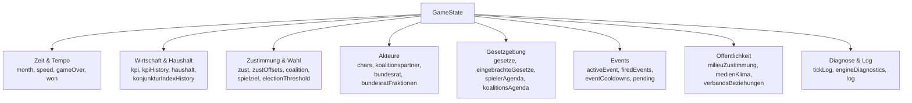
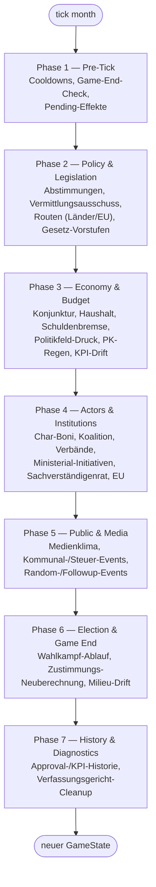
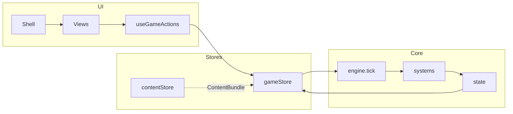

# Architektur

Überblick über State-Management, Engine-Pipeline, Datenfluss und Backend-Rolle.

---

## Frontend: State und Spiel-Logik

### Zustand-Stores

- **gameStore** (`frontend/src/store/gameStore.ts`):
  Hält `state: GameState` und `content: ContentBundle`. Bietet Aktionen wie `init`, `gameTick`, `setSpeed`, `setView`, `doEinbringen`, `doLobbying`, `doAbstimmen`, `doStartRoute`, `doResolveEvent`, `doMedienkampagne`, `doLobbyLand`, `toggleAgenda`, `loadSave`. Der Spielzustand wird **ausschließlich** über diese Aktionen geändert — keine direkten Mutationen von außerhalb des Stores.
- **uiStore** (`frontend/src/store/uiStore.ts`):
  UI-Zustand (z. B. Modals, Toasts), getrennt vom Spielstate.
- **authStore** (`frontend/src/store/authStore.ts`):
  Authentifizierung (JWT, Login-Status).
- **contentStore** (`frontend/src/stores/contentStore.ts`):
  Lädt und hält das `ContentBundle` (Szenario, Gesetze, Events, Charaktere, Bundesrat, Milieus, …) von `GET /api/content/game`, mit lokalem Fallback (siehe [Frontend ↔ Backend](#frontend-backend)).

### Store vs. Core — Verantwortung

Die Trennung zwischen `store/` und `core/` ist bewusst:

| Schicht | Verantwortung |
|---|---|
| **`core/`** (Engine, State, Systems) | Reine, deterministische TypeScript-Funktionen ohne UI- oder Framework-Abhängigkeit. Nimmt einen `GameState` + `ContentBundle` entgegen und liefert einen neuen `GameState` zurück (`s = system(s)`, keine In-Place-Mutation). Vollständig unit-testbar ohne React/Zustand. |
| **`store/gameStore.ts`** | Bindeglied zwischen UI und Core: hält den aktuellen `GameState` als Zustand, ruft bei Aktionen (`gameTick`, `doEinbringen`, …) die entsprechenden `core/`-Funktionen auf und schreibt das Ergebnis zurück in den Store. Enthält selbst **keine** Spiellogik, nur Orchestrierung + Persistenz-Trigger (Autosave, `services/saves.ts`). |
| **UI (`ui/`)** | Liest Store-Zustand über Hooks/Selektoren, löst Aktionen aus. Kennt `GameState`-Interna nur über Typen aus `core/types/`, nie über eigene Kopien der Logik. |

Diese Trennung erlaubt es, die komplette Spiellogik (inkl. Balance-Simulation, siehe unten) ohne DOM/Browser laufen zu lassen.

### Game-State und Typen

Die Struktur des Spielzustands ist im GDD unter [Technischer Stack (Spiel) → State-Architektur](../game-design/tech-stack.md#63-state-architektur) beschrieben. Die TypeScript-Definitionen liegen in `frontend/src/core/types/` (aufgeteilt nach Domäne: `state.ts`, `law.ts`, `character.ts`, `event.ts`, `politics.ts`, `wirtschaft.ts`, `agenda.ts`, `common.ts`, re-exportiert über `index.ts`). Der initiale State wird in `frontend/src/core/state.ts` aus einem `ContentBundle` erzeugt.

#### GameState-Domänenkarte

`GameState` (`core/types/state.ts`) bündelt mehrere fachliche Domänen in einem flachen Objekt:

Jede Domäne wird primär von den gleichnamigen Modulen in `core/systems/` gelesen/geschrieben (z. B. `haushalt.ts` ↔ Wirtschaft & Haushalt, `bundesrat.ts` ↔ Akteure, `events.ts` ↔ Events). Neue Felder gehören in die Domäne, deren System sie primär pflegt — vermeidet Querzugriffe zwischen Systemen auf fremde State-Bereiche.

### Engine-Pipeline (`tick()`)

Ein Spieltick (ein Monat) läuft in `frontend/src/core/engine.ts` über eine **deklarative Pipeline-Registry** (`ENGINE_PIPELINE`): eine geordnete Liste von `EnginePhase`n, jede mit benannten `EngineSystem`en. `tick(state, content)` iteriert generisch darüber — Reihenfolge, Feature-Gating (`feature`-Key + `featureActive()`) und Early-Exit (`checkAbort`) sind deklarativ in der Registry hinterlegt statt in imperativem Code. Systeme mit `safe: true` laufen in `try/catch`: ein einzelner Fehler wird geloggt (`ctx.failedSystems`, sichtbar in `engineDiagnostics`) und bricht den Tick nicht ab.

Die konkreten Systeme je Phase (Funktionsnamen, Feature-Gates) stehen im `ENGINE_PIPELINE`-Array in `engine.ts` selbst — dort ist die Reihenfolge die Quelle der Wahrheit; dieses Dokument beschreibt nur die Struktur. Die einzelnen Regeln liegen in `frontend/src/core/systems/` (u. a. economy, wahlprognose, characters, coalition, koalition, levels, events, election, parliament, bundesrat, media, medienklima, procgen, gesetzLebenszyklus, haushalt, wirtschaft, ministerialInitiativen, ministerAgenden, eu, politikfeldDruck, verbaende, sachverstaendigenrat, vermittlung, milieus). Die UI triggert Ticks über einen Timer (`frontend/src/ui/hooks/useGameTick.ts`).

Nach jedem Tick wird über `core/monatszusammenfassung.ts` ein `MonatsDiff` (Ursachen für KPI-/Zustimmungsänderungen) aus dem State vor/nach dem Tick berechnet — Basis für die Monatszusammenfassung in der UI.

### Datenfluss (vereinfacht)

- Nutzerinteraktionen laufen über Aktionen aus dem gameStore (direkt oder über Hooks).
- `gameTick` ruft `tick(state, content)` auf und schreibt den neuen State zurück in den Store.
- Kein Redux; der gameStore hält eine einzige Quelle der Wahrheit für den Spielzustand.

### Balance-Simulation & Report-Pipeline

Die Spielbalance wird über eine Monte-Carlo-Simulation gegen die **echte** Engine geprüft (nicht über ein separates Modell):

- `frontend/src/core/simulation/balanceSim.ts` führt vordefinierte Strategien (`strategien.ts`) gegen die reale `tick()`-Funktion aus `core/engine.ts` aus — inklusive echter Commands (`doEinbringen`, Lobbying, Medienkampagne, Wahlkampf-Aktionen etc.).
- `balanceSim.test.ts` / `balanceReport.test.ts` (Vitest) prüfen Kennzahlen wie Sieg-/Niederlagequote je Komplexitätsstufe.
- `frontend/scripts/balanceReport.ts` (CLI, `npm run balance:report`) führt die Simulation mit seedbarem PRNG (deterministisch reproduzierbar) über alle Strategien und Komplexitätsstufen 1–4 und schreibt einen Markdown-Report.
- Der CI-Workflow **`balance-check.yml`** (siehe [CI/CD](#cicd)) führt bei Änderungen an Content oder `core/` den Simulation-Testlauf aus und lädt den generierten `balance-report.md` als Artefakt hoch.

---

## Frontend ↔ Backend

Das Frontend spricht die API über `frontend/src/services/api.ts` an (`apiFetch`, Basis-URL aus `VITE_API_URL`). JWT-Access-Token aus dem `authStore` werden mitgeschickt, Refresh läuft über ein HttpOnly-Cookie. Content wird beim Start über `GET /api/content/game?locale=` geladen (`contentStore`); schlägt das fehl, greift ein lokaler Offline-Fallback (`frontend/src/data/defaults/`) mit eingeschränktem Content (siehe #244 zur geplanten Reduktion dieses Fallbacks). Die Produktion baut das Frontend und liefert es über nginx aus; API-Anfragen werden per Proxy an den Backend-Container weitergeleitet (`/api` → Backend).

---

## Backend (Struktur)

Das Backend wird mit **FastAPI** betrieben (`uvicorn app.main:app`). Paket `app` unter `backend/` mit:

- **`app/main.py`** — FastAPI-Instanz, CORS, Security-Header-Middleware, Router unter `/api/*`; Health unter `/api/health`
- **`app/config.py`** — Einstellungen (Pydantic Settings)
- **`app/dependencies.py`** — Abhängigkeiten für Routen (u. a. DB-Session, aktueller User, Locale-Validierung)
- **`app/limiter.py`** — Rate-Limiting (slowapi)
- **`app/routes/`** — auth, saves, content, analytics, mods, admin
- **`app/models/`** — SQLAlchemy-Modelle (User, GameSave, Content-Tabellen inkl. i18n-Varianten, Analytics, Mod)
- **`app/schemas/`** — Pydantic-Schemas pro Modul
- **`app/services/`** — auth_service, save_service, content_service, content_db_service, analytics_service, mod_validator, …
- **`app/db/`** — database.py, migrations/ (Alembic)
- **`app/content/`** — YAML-Rohdaten (scenarios/, laws/, characters/, events/), von `content_db_service` in die DB importiert

Datenbankzugriff per **SQLAlchemy 2** (async, Treiber **asyncpg**), Migrationen mit **Alembic**. Umgebungsvariablen (siehe [Lokales Setup](setup.md)): `DATABASE_URL`, `SECRET_KEY`, `CORS_ORIGINS`, `ADMIN_USER`/`ADMIN_PASSWORD`, `SMTP_*`, optional `DEBUG`. OpenAPI-Dokumentation: `/api/docs`, Spezifikation `/api/openapi.json`.

### Rolle des Backends: Content, Saves, Auth — keine Simulation

Wichtige Abgrenzung: **Das Backend führt zu keinem Zeitpunkt die Spielsimulation (`tick()`) aus.** Die gesamte Spiellogik läuft ausschließlich im Frontend (`core/engine.ts`). Das Backend übernimmt vier Rollen:

1. **Content-Auslieferung** — YAML-Content wird in die DB geladen und über `GET /api/content/*` (inkl. des gebündelten `GET /api/content/game`) als JSON an das Frontend ausgeliefert; Admin-CRUD (`/api/admin/*`, Basic Auth) pflegt Content in der DB.
2. **Spielstände (Saves)** — `POST/GET/PUT/DELETE /api/saves/{id}` persistiert den vom Frontend übergebenen `GameState` als **opakes JSONB-Blob** (`models/save.py: GameSave.game_state`). Das Backend interpretiert oder validiert den State fachlich nicht — es speichert und liefert ihn unverändert zurück.
3. **Auth** — JWT-Access-Token (kurzlebig) + HttpOnly-Refresh-Cookie + Magic-Link-Login.
4. **Analytics** — Sammelt anonyme Client-Events (`POST /api/analytics/batch`) für Community-Stats/Highscores.

Für die Spiellogik selbst ist das Backend also reiner Datenspeicher/-lieferant, keine "Autorität" — Balance und Spielregeln werden vollständig clientseitig in `core/` bestimmt und getestet (siehe Balance-Simulation oben).

---

## CI/CD

| Workflow | Trigger | Was es tut |
|---|---|---|
| `lint.yml` | Push auf `main`, PRs | Ruff check/format + MyPy + pip-audit + Bandit (Backend), ESLint + npm audit (Frontend), API-Types-Drift-Check, Gitleaks-Secret-Scan, Trivy-Container-Scan |
| `deploy.yml` | Push auf `main` | pytest + npm build, danach SSH-Deploy auf den Server |
| `balance-check.yml` | Änderungen an Content/`core/`/Balance-Scripts/Workflow | Monte-Carlo-Simulation (siehe oben) + Balance-Report als Artefakt |
| `docs.yml` | Push auf `main` | MkDocs-Build und -Deploy |

Es gibt **keine** `scenarios.yml`-Pipeline — das war ein veralteter Verweis (siehe #233).
